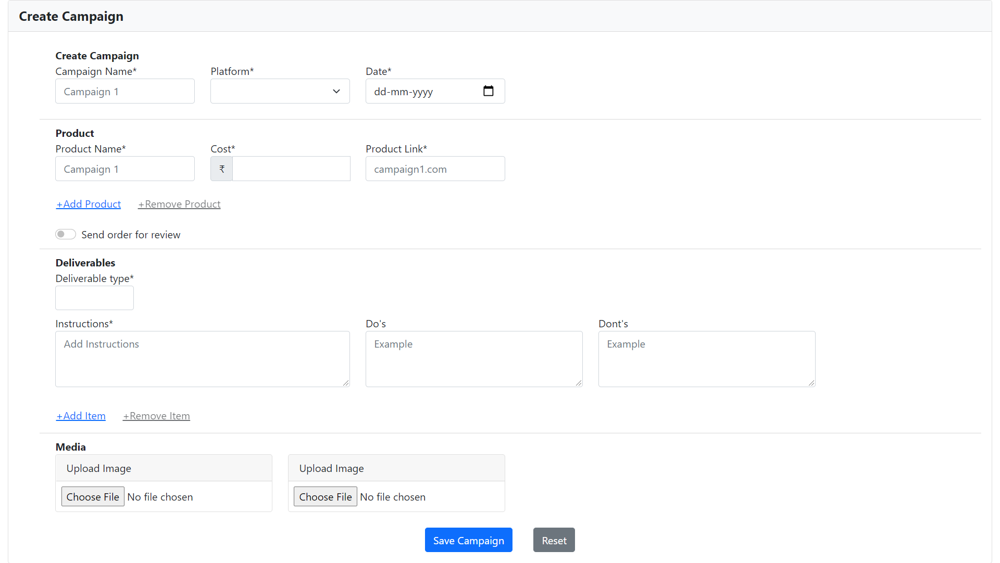
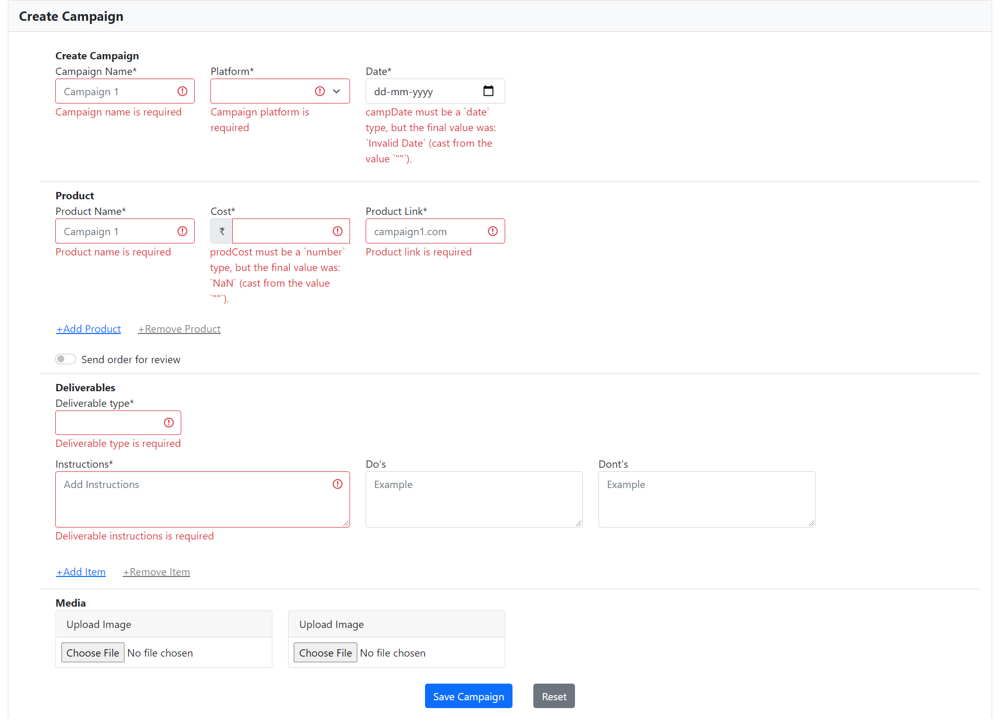
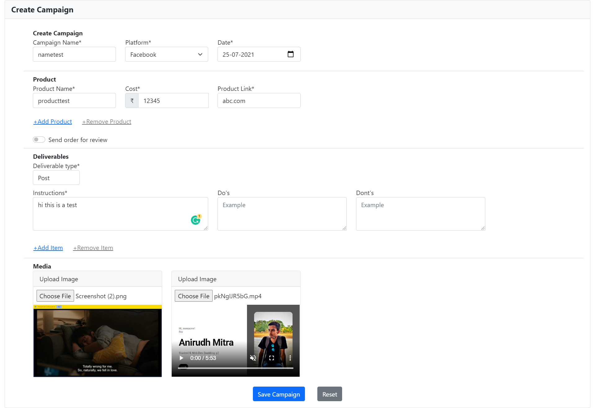
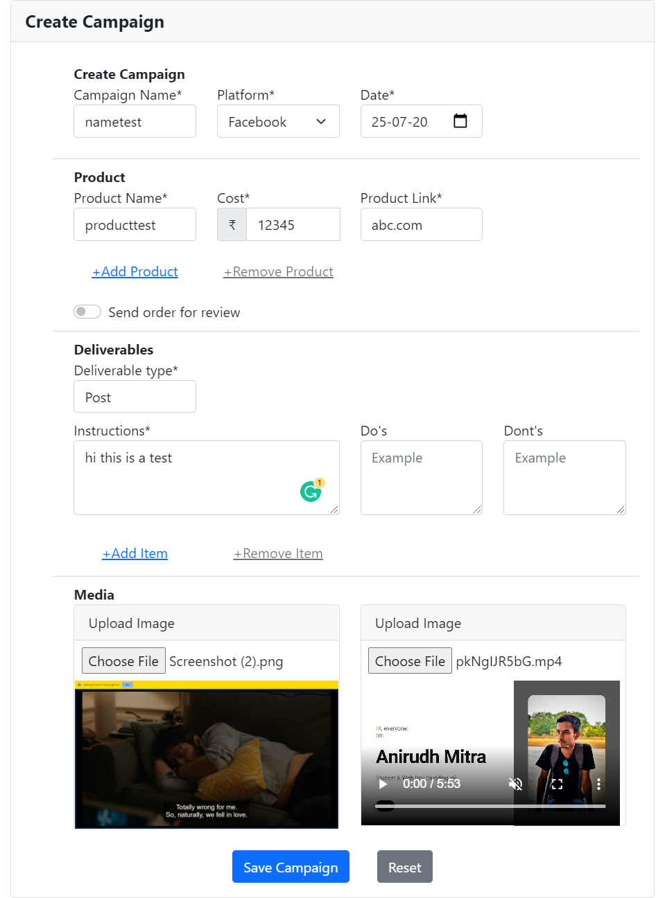
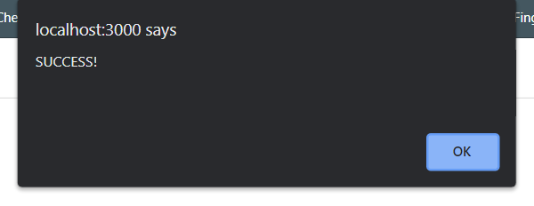
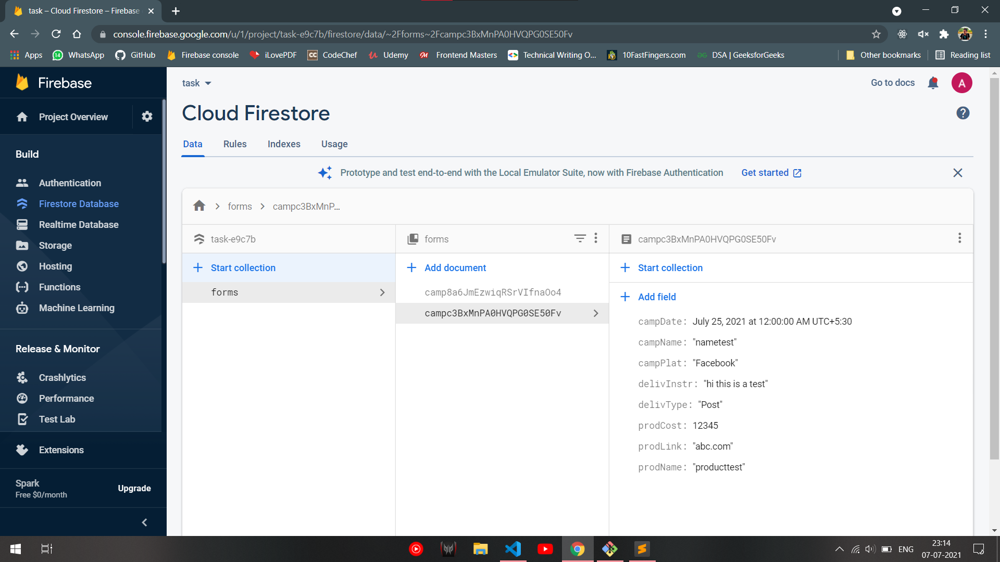

<link
      rel="stylesheet"
      href="https://cdnjs.cloudflare.com/ajax/libs/font-awesome/5.15.3/css/all.min.css"
      integrity="sha512-iBBXm8fW90+nuLcSKlbmrPcLa0OT92xO1BIsZ+ywDWZCvqsWgccV3gFoRBv0z+8dLJgyAHIhR35VZc2oM/gI1w=="
      crossorigin="anonymous"
    />

# Create Campaign Page

# Table of Contents <i class="fas fa-table"></i>

- [Create campaign](#create-campaign-page)
- [Table of Contents](#table-of-contents-)
- [Screenshots](#screenshots-)
  - [Form view](#form-view)
  - [Validations](#validations)
  - [With input](#with-input)
  - [Responsive](#responsive)
  - [Alert on success](#alert-on-success)
  - [Firestore Database](#firestore-database)

## Screenshots <i class="fas fa-table"></i>

#### Form view

#### Validations

#### With input

#### Responsive

#### Alert on success

#### Firestore Database

&nbsp;

 <i class="fas fa-code"></i> by <a href="https://github.com/anirudh4583">Anirudh</a>
